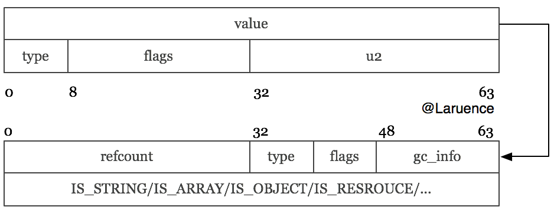

### 深入理解PHP7之zval

PHP7已经发布, 如承诺, 我也要开始这个系列的文章的编写, 今天我想先和大家聊聊zval的变化. 在讲zval变化的之前我们先来看看zval在PHP5下面是什么样子

##### 版权申明:
````
本文是原创作品，包括文字、资料、图片、网页格式，转载时请标注作者与来源。非经允许，不得用于赢利目的。
````

#### PHP5
##### zval回顾
在PHP5的时候, zval的定义如下:
````c
struct _zval_struct {
	union {
		long lval;
		double dval;
		struct {
			char *val;
			int len;
		} str;
		HashTable *ht;
		zend_object_value obj;
		zend_ast *ast;
	} value;
	zend_uint refcount__gc;
	zend_uchar type;
	zend_uchar is_ref__gc;
};

````

对PHP5内核有了解的同学应该对这个结构比较熟悉, 因为zval可以表示一切PHP中的数据类型, 所以它包含了一个type字段, 表示这个zval存储的是什么类型的值, 常见的可能选项是`IS_NULL`, `IS_LONG`, `IS_STRING`, `IS_ARRAY`, `IS_OBJECT`等等.

根据type字段的值不同, 我们就要用不同的方式解读value的值, 这个value是个联合体, 比如对于type是`IS_STRING`, 那么我们应该用`value.str`来解读`zval.value`字段, 而如果type是`IS_LONG`, 那么我们就要用`value.lval`来解读.

另外, 我们知道PHP是用引用计数来做基本的垃圾回收的, 所以zval中有一个`refcount__gc`字段, 表示这个zval的引用数目, 但这里有一个要说明的, 在5.3以前, 这个字段的名字还叫做`refcount`, 5.3以后, 在引入新的垃圾回收算法来对付循环引用计数的时候, 作者加入了大量的宏来操作`refcount`, 为了能让错误更快的显现, 所以改名为`refcount__gc`, 迫使大家都使用宏来操作`refcount`.

类似的, 还有`is_ref`, 这个值表示了PHP中的一个类型是否是引用, 这里我们可以看到是不是引用是一个标志位.

这就是PHP5时代的zval, 在2013年我们做PHP5的opcache JIT的时候, 因为JIT在实际项目中表现不佳, 我们转而意识到这个结构体的很多问题. 而PHPNG项目就是从改写这个结构体而开始的.

##### 存在的问题

PHP5的zval定义是随着Zend Engine 2诞生的, 随着时间的推移, 当时设计的局限性也越来越明显:

首先这个结构体的大小是(在64位系统)24个字节, 我们仔细看这个`zval.value`联合体, 其中`zend_object_value`是最大的长板, 它导致整个value需要16个字节, 这个应该是很容易可以优化掉的, 比如把它挪出来, 用个指针代替,因为毕竟`IS_OBJECT`也不是最最常用的类型.

第二, 这个结构体的每一个字段都有明确的含义定义, 没有预留任何的自定义字段, 导致在PHP5时代做很多的优化的时候, 需要存储一些和zval相关的信息的时候, 不得不采用其他结构体映射, 或者外部包装后打补丁的方式来扩充zval, 比如5.3的时候新引入专门解决循环引用的GC, 它不得采用如下的比较hack的做法:
````c
/* The following macroses override macroses from zend_alloc.h */
#undef  ALLOC_ZVAL
#define ALLOC_ZVAL(z)                                   \
    do {                                                \
        (z) = (zval*)emalloc(sizeof(zval_gc_info));     \
        GC_ZVAL_INIT(z);                                \
    } while (0)
````

它用`zval_gc_info`劫持了zval的分配:
````c
typedef struct _zval_gc_info {
    zval z;
    union {
        gc_root_buffer       *buffered;
        struct _zval_gc_info *next;
    } u;
} zval_gc_info;
````

然后用`zval_gc_info`来扩充了zval, 所以实际上来说我们在PHP5时代申请一个zval其实真正的是分配了32个字节, 但其实GC只需要关心`IS_ARRAY和IS_OBJECT`类型, 这样就导致了大量的内存浪费.

还比如我之前做的Taint扩展, 我需要对于给一些字符串存储一些标记, zval里没有任何地方可以使用, 所以我不得不采用非常手段:
````c
Z_STRVAL_PP(ppzval) = erealloc(Z_STRVAL_PP(ppzval), Z_STRLEN_PP(ppzval) + 1 + PHP_TAINT_MAGIC_LENGTH);
PHP_TAINT_MARK(*ppzval, PHP_TAINT_MAGIC_POSSIBLE);
````
就是把字符串的长度扩充一个int, 然后用magic number做标记写到后面去, 这样的做法安全性和稳定性在技术上都是没有保障的

第三, PHP的zval大部分都是按值传递, 写时拷贝的值, 但是有俩个例外, 就是对象和资源, 他们永远都是按引用传递, 这样就造成一个问题, 对象和资源在除了zval中的引用计数以外, 还需要一个全局的引用计数, 这样才能保证内存可以回收. 所以在PHP5的时代, 以对象为例, 它有俩套引用计数, 一个是zval中的, 另外一个是obj自身的计数:
````c
typedef struct _zend_object_store_bucket {
    zend_bool destructor_called;
    zend_bool valid;
    union _store_bucket {
        struct _store_object {
            void *object;
            zend_objects_store_dtor_t dtor;
            zend_objects_free_object_storage_t free_storage;
            zend_objects_store_clone_t clone;
            const zend_object_handlers *handlers;
            zend_uint refcount;
            gc_root_buffer *buffered;
        } obj;
        struct {
            int next;
        } free_list;
    } bucket;
} zend_object_store_bucket;
````

除了上面提到的两套引用以外, 如果我们要获取一个object, 则我们需要通过如下方式:

````c
EG(objects_store).object_buckets[Z_OBJ_HANDLE_P(z)].bucket.obj
````

经过漫长的多次内存读取, 才能获取到真正的objec对象本身. 效率可想而知.

这一切都是因为Zend引擎最初设计的时候, 并没有考虑到后来的对象. 一个良好的设计, 一旦有了意外, 就会导致整个结构变得复杂, 维护性降低, 这是一个很好的例子.

第四, 我们知道PHP中, 大量的计算都是面向字符串的, 然而因为引用计数是作用在zval的, 那么就会导致如果要拷贝一个字符串类型的zval, 我们别无他法只能复制这个字符串. 当我们把一个zval的字符串作为key添加到一个数组里的时候, 我们别无他法只能复制这个字符串. 虽然在PHP5.4的时候, 我们引入了INTERNED STRING, 但是还是不能根本解决这个问题.

还比如, PHP中大量的结构体都是基于Hashtable实现的, 增删改查Hashtable的操作占据了大量的CPU时间, 而字符串要查找首先要求它的Hash值, 理论上我们完全可以把一个字符串的Hash值计算好以后, 就存下来, 避免再次计算等等

第五, 这个是关于引用的, PHP5的时代, 我们采用写时分离, 但是结合到引用这里就有了一个经典的性能问题:

````php
<?php

    function dummy($array) {}

    $array = range(1, 100000);

    $b = &$array;

    dummy($array);
?>
````

当我们调用dummy的时候, 本来只是简单的一个传值就行的地方, 但是因为$array曾经引用赋值给了$b, 所以导致$array变成了一个引用, 于是此处就会发生分离, 导致数组复制, 从而极大的拖慢性能, 这里有一个简单的测试:

````php
<?php
$array = range(1, 100000);

function dummy($array) {}

$i = 0;
$start = microtime(true);
while($i++ < 100) {
    dummy($array);
}

printf("Used %sS\n", microtime(true) - $start);

$b = &$array; //注意这里, 假设我不小心把这个Array引用给了一个变量
$i = 0;
$start = microtime(true);
while($i++ < 100) {
    dummy($array);
}
printf("Used %sS\n", microtime(true) - $start);
?>
````

我们在5.6下运行这个例子, 得到如下结果:
````
$ php-5.6/sapi/cli/php /tmp/1.php
Used 0.00045204162597656S
Used 4.2051479816437S
````
相差1万倍之多. 这就造成, 如果在一大段代码中, 我不小心把一个变量变成了引用(比如foreach as &$v), 那么就有可能触发到这个问题, 造成严重的性能问题, 然而却又很难排查.

第六, 也是最重要的一个, 为什么说它重要呢? 因为这点促成了很大的性能提升, 我们习惯了在PHP5的时代调用`MAKE_STD_ZVAL`在堆内存上分配一个zval, 然后对他进行操作, 最后呢通过`RETURN_ZVAL`把这个zval的值"copy"给`return_value`, 然后又销毁了这个zval, 比如`pathinfo`这个函数:
````c
PHP_FUNCTION(pathinfo)
{
.....
	MAKE_STD_ZVAL(tmp);
	array_init(tmp);
.....

    if (opt == PHP_PATHINFO_ALL) {
        RETURN_ZVAL(tmp, 0, 1);
    } else {
.....
}
````

这个tmp变量, 完全是一个临时变量的作用, 我们又何必在堆内存分配它呢? `MAKE_STD_ZVAL/ALLOC_ZVAL`在PHP5的时候, 到处都有, 是一个非常常见的用法, 如果我们能把这个变量用栈分配, 那无论是内存分配, 还是缓存友好, 都是非常有利的

还有很多, 我就不一一详细列举了, 但是我相信你们也有了和我们当时一样的想法, zval必须得改改了, 对吧?

#### PHP7

##### 现在的zval
到了PHP7中, zval变成了如下的结构, 要说明的是, 这个是现在的结构, 已经和PHPNG时候有了一些不同了, 因为我们新增加了一些解释 (联合体的字段), 但是总体大小, 结构, 是和PHPNG的时候一致的:
````c
struct _zval_struct {
	union {
		zend_long         lval;             /* long value */
		double            dval;             /* double value */
		zend_refcounted  *counted;
		zend_string      *str;
		zend_array       *arr;
		zend_object      *obj;
		zend_resource    *res;
		zend_reference   *ref;
		zend_ast_ref     *ast;
		zval             *zv;
		void             *ptr;
		zend_class_entry *ce;
		zend_function    *func;
		struct {
			uint32_t w1;
			uint32_t w2;
		} ww;
	} value;
    union {
        struct {
            ZEND_ENDIAN_LOHI_4(
                zend_uchar    type,         /* active type */
                zend_uchar    type_flags,
                zend_uchar    const_flags,
                zend_uchar    reserved)     /* call info for EX(This) */
        } v;
        uint32_t type_info;
    } u1;
    union {
        uint32_t     var_flags;
        uint32_t     next;                 /* hash collision chain */
        uint32_t     cache_slot;           /* literal cache slot */
        uint32_t     lineno;               /* line number (for ast nodes) */
        uint32_t     num_args;             /* arguments number for EX(This) */
        uint32_t     fe_pos;               /* foreach position */
        uint32_t     fe_iter_idx;          /* foreach iterator index */
    } u2;
};
````

虽然看起来变得好大, 但其实你仔细看, 全部都是联合体, 这个新的zval在64位环境下,现在只需要16个字节(2个指针size), 它主要分为俩个部分, `value`和扩充字段, 而扩充字段又分为`u1`和`u2`俩个部分, 其中`u1`是type info,  `u2`是各种辅助字段.


其中`value`部分, 是一个`size_t`大小(一个指针大小), 可以保存一个指针, 或者一个`long`, 或者一个`double`.

而type info部分则保存了这个zval的类型. 扩充辅助字段则会在多个其他地方使用, 比如`next`, 就用在取代Hashtable中原来的拉链指针, 这部分会在以后介绍HashTable的时候再来详解.


##### 类型

PHP7中的zval的类型做了比较大的调整, 总体来说有如下17种类型:
````c
/* regular data types */
#define IS_UNDEF                    0
#define IS_NULL                     1
#define IS_FALSE                    2
#define IS_TRUE                     3
#define IS_LONG                     4
#define IS_DOUBLE                   5
#define IS_STRING                   6
#define IS_ARRAY                    7
#define IS_OBJECT                   8
#define IS_RESOURCE                 9
#define IS_REFERENCE                10

/* constant expressions */
#define IS_CONSTANT                 11
#define IS_CONSTANT_AST             12

/* fake types */
#define _IS_BOOL                    13
#define IS_CALLABLE                 14

/* internal types */
#define IS_INDIRECT                 15
#define IS_PTR                      17
````

其中PHP5的时候的`IS_BOOL`类型, 现在拆分成了`IS_FALSE`和`IS_TRUE`俩种类型. 而原来的引用是一个标志位, 现在的引用是一种新的类型.

对于`IS_INDIRECT`和`IS_PTR`来说, 这俩个类型是用在内部的保留类型, 用户不会感知到, 这部分会在后续介绍HashTable的时候也一并介绍.

从PHP7开始, 对于在zval的`value`字段中能保存下的值, 就不再对他们进行引用计数了, 而是在拷贝的时候直接赋值, 这样就省掉了大量的引用计数相关的操作, 这部分类型有:
````
IS_LONG
IS_DOUBLE
````
当然对于那种根本没有值, 只有类型的类型, 也不需要引用计数了:
````
IS_NULL
IS_FALSE
IS_TRUE
````

而对于复杂类型, 一个`size_t`保存不下的, 那么我们就用`value`来保存一个指针, 这个指针指向这个具体的值, 引用计数也随之作用于这个值上, 而不在是作用于zval上了.



以`IS_ARRAY`为例:

````c
struct _zend_array {
    zend_refcounted_h gc;
    union {
        struct {
            ZEND_ENDIAN_LOHI_4(
                zend_uchar    flags,
                zend_uchar    nApplyCount,
                zend_uchar    nIteratorsCount,
                zend_uchar    reserve)
        } v;
        uint32_t flags;
    } u;
    uint32_t          nTableMask;
    Bucket           *arData;
    uint32_t          nNumUsed;
    uint32_t          nNumOfElements;
    uint32_t          nTableSize;
    uint32_t          nInternalPointer;
    zend_long         nNextFreeElement;
    dtor_func_t       pDestructor;
};
````

`zval.value.arr`将指向上面的这样的一个结构体, 由它实际保存一个数组, 引用计数部分保存在`zend_refcounted_h`结构中:
````c
typedef struct _zend_refcounted_h {
    uint32_t         refcount;          /* reference counter 32-bit */
    union {
        struct {
            ZEND_ENDIAN_LOHI_3(
                zend_uchar    type,
                zend_uchar    flags,    /* used for strings & objects */
                uint16_t      gc_info)  /* keeps GC root number (or 0) and color */
        } v;
        uint32_t type_info;
    } u;
} zend_refcounted_h;
````

所有的复杂类型的定义, 开始的时候都是`zend_refcounted_h`结构, 这个结构里除了引用计数以外, 还有GC相关的结构. 从而在做GC回收的时候, GC不需要关心具体类型是什么, 所有的它都可以当做`zend_refcounted*`结构来处理.

另外有一个需要说明的就是大家可能会好奇的`ZEND_ENDIAN_LOHI_4`宏, 这个宏的作用是简化赋值, 它会保证在大端或者小端的机器上, 它定义的字段都按照一样顺序排列存储, 从而我们在赋值的时候, 不需要对它的字段分别赋值, 而是可以统一赋值, 比如对于上面的array结构为例, 就可以通过:
````c
arr1.u.flags = arr2.u.flags;
````
一次完成相当于如下的赋值序列:
````c
arr1.u.v.flags				= arr2.u.v.flags;
arr1.u.v.nApplyCount 		= arr2.u.v.nApplyCount;
arr1.u.v.nIteratorsCount	= arr2.u.v.nIteratorsCount;
arr1.u.v.reserve 			= arr2.u.v.reserve;
````

还有一个大家可能会问到的问题是, 为什么不把type类型放到zval类型的前面, 因为我们知道当我们去用一个zval的时候, 首先第一点肯定是先去获取它的类型. 这里的一个原因是, 一个是俩者差别不大, 另外就是考虑到如果以后JIT的话, zval的类型如果能够通过类型推导获得, 就根本没有必要去读取它的type值了.

##### 标志位

除了数据类型以外， 以前的经验也告诉我们， 一个数据除了它的类型以外， 还应该有很多其他的属性， 比如对于INTERNED STRING，它是一种在整个PHP请求期都存在的字符串(比如你写在代码中的字面量), 它不会被引用计数回收. 在5.4的版本中我们是通过预先申请一块内存， 然后再这个内存中分配字符串， 最后用指针地址来比较， 如果一个字符串是属于INTERNED STRING的内存范围内， 就认为它是INTERNED STRING. 这样做的缺点显而易见， 就是当内存不够的时候， 我们就没有办法分配INTERNED STRING了， 另外也非常丑陋， 所以如果一个字符串能有一些属性定义则这个实现就可以变得很优雅.

还有， 比如现在我们对于`IS_LONG`, `IS_TRUE`等类型不再进行引用计数了， 那么当我们拿到一个zval的时候如何判断它需要不需要引用计数呢？ 想当然的我们可能会说用:
````c
if (Z_TYPE_P(zv) >= IS_STRING) {
  //需要引用计数
}
````

但是你忘了， 还有INTERNED STRING的存在啊， 所以你也许要这么写了：
````c
if (Z_TYPE_P(zv) >= IS_STRING && !IS_INTERNED(Z_STR_P(zv))) {
  //需要引用计数
}
````

是不是已经让你感觉到有点不对劲了? 嗯，别急， 还有呢， 我们还在5.6的时候引入了常量数组， 这个数组呢会存储在Opcache的共享内存中， 它也不需要引用计数：

````c
if (Z_TYPE_P(zv) >= IS_STRING && !IS_INTERNED(Z_STR_P(zv))
    && (Z_TYPE_P(zv) != IS_ARRAY || !Z_IS_IMMUTABLE(Z_ARRVAL(zv)))) {
 //需要引用计数
}
````
你是不是也觉得这简直太丑陋了， 简直不能忍受这样墨迹的代码， 对吧？

是的，我们早想到了，回头看之前的zval定义， 注意到`type_flags`了么? 我们引入了一个标志位， 叫做`IS_TYPE_REFCOUNTED`, 它会保存在`zval.u1.v.type_flags`中， 我们对于需要引用计数的类型就赋予这个标志， 所以上面的判断就可以变得很优雅：
````c
if (!(Z_TYPE_FLAGS(zv) & IS_TYPE_REFCOUNTED)) {
}
````

而对于INTERNED STRING来说， 这个`IS_STR_INTERNED`标志位应该是作用于字符串本身而不是zval的.

那么类似这样的标志位一共有多少呢？作用于zval的有：
````c
IS_TYPE_CONSTANT            //是常量类型
IS_TYPE_IMMUTABLE           //不可变的类型， 比如存在共享内存的数组
IS_TYPE_REFCOUNTED          //需要引用计数的类型
IS_TYPE_COLLECTABLE         //可能包含循环引用的类型(IS_ARRAY, IS_OBJECT)
IS_TYPE_COPYABLE            //可被复制的类型， 还记得我之前讲的对象和资源的例外么？ 对象和资源就不是
IS_TYPE_SYMBOLTABLE         //zval保存的是全局符号表， 这个在我之前做了一个调整以后没用了， 但还保留着兼容，
                            //下个版本会去掉
````
作用于字符串的有:
````c
IS_STR_PERSISTENT	        //是malloc分配内存的字符串
IS_STR_INTERNED             //INTERNED STRING
IS_STR_PERMANENT            //不可变的字符串， 用作哨兵作用
IS_STR_CONSTANT             //代表常量的字符串
IS_STR_CONSTANT_UNQUALIFIED //带有可能命名空间的常量字符串
````
作用于数组的有:
````c
#define IS_ARRAY_IMMUTABLE  //同IS_TYPE_IMMUTABLE
````
作用于对象的有：
````c
IS_OBJ_APPLY_COUNT          //递归保护
IS_OBJ_DESTRUCTOR_CALLED    //析构函数已经调用
IS_OBJ_FREE_CALLED          //清理函数已经调用
IS_OBJ_USE_GUARDS           //魔术方法递归保护
IS_OBJ_HAS_GUARDS           //是否有魔术方法递归保护标志
````
有了这些预留的标志位， 我们就会很方便的做一些以前不好做的事情， 就比如我自己的Taint扩展， 现在把一个字符串标记为污染的字符串就会变得无比简单：
````c
/* it's important that make sure
 * this value is not used by Zend or
 * any other extension agianst string */
#define IS_STR_TAINT_POSSIBLE    (1<<7)
#define TAINT_MARK(str)     (GC_FLAGS((str)) |= IS_STR_TAINT_POSSIBLE)
````
这个标记就会一直随着这个字符串的生存而存在的， 省掉了我之前的很多tricky的做法.

#### ZVAL预先分配
 前面我们说过, PHP5的zval分配采用的是堆上分配内存, 也就是在PHP预案代码中随处可见的MAKE_STD_ZVAL和ALLOC_ZVAL宏. 我们也知道了本来一个zval只需要24个字节, 但是算上gc_info, 其实分配了32个字节, 再加上PHP自己的内存管理在分配内存的时候都会在内存前面保留一部分信息:
````c
typedef struct _zend_mm_block {
    zend_mm_block_info info;
#if ZEND_DEBUG
    unsigned int magic;
# ifdef ZTS
    THREAD_T thread_id;
# endif
    zend_mm_debug_info debug;
#elif ZEND_MM_HEAP_PROTECTION
    zend_mm_debug_info debug;
#endif
} zend_mm_block;
````

  从而导致实际上我们只需要24字节的内存, 但最后竟然分配48个字节之多.


  然而大部分的zval, 尤其是扩展函数内的zval, 我们想想它接受的参数来自外部的zval, 它把返回值返回给return_value, 这个也是来自外部的zval, 而中间变量的zval完全可以采用栈上分配. 也就是说大部分的内部函数都不需要在堆上分配内存, 它需要的zval都可以来自外部.

  于是当时我们做了一个大胆的想法, 所有的zval都不需要单独申请.

  而这个也很容易证明, PHP脚本中使用的zval, 要么存在于符号表, 要么就以临时变量(`IS_TMP_VAR`)或者编译变量(`IS_CV`)的形式存在. 前者存在于一个Hashtable中, 而在PHP7中Hashtable默认保存的就是zval, 这部分的zval完全可以在Hashtable分配的时候一次性分配出来, 后面的存在于execute_data之后, 数量也在编译时刻确定好了, 也可以随着execute_data一次性分配, 所以我们确实不再需要单独在堆上申请zval了.

  所以, 在PHP7开始, 我们移除了MAKE_STD_ZVAL/ALLOC_ZVAL宏, 不再支持存堆内存上申请zval. 函数内部使用的zval要么来自外面输入, 要么使用在栈上分配的临时zval.

  在后来的实践中, 总结出来的可能对于开发者来说最大的变化就是, 之前的一些内部函数, 通过一些操作获得一些信息, 然后分配一个zval, 返回给调用者的情况:
````c
static zval * php_internal_function() {
    .....
    str = external_function();

    MAKE_STD_ZVAL(zv);

    ZVAL_STRING(zv, str, 0);

	return zv;
}
PHP_FUNCTION(test) {
	RETURN_ZVAL(php_internal_function(), 1, 1);
}
````

  要么修改为, 这个zval由调用者传递:

````c
static void php_internal_function(zval *zv) {
    .....
    str = external_function();

    ZVAL_STRING(zv, str);
	efree(str);
}

PHP_FUNCTION(test) {
	php_internal_function(return_value);
}
````

   要么修改为, 这个函数返回原始素材:
````c
static char * php_internal_function() {
    .....
    str = external_function();
	return str;
}

PHP_FUNCTION(test) {
	str = php_internal_function();
	RETURN_STRING(str);
	efree(str);
}
````

#### 总结

  (这块还没想好怎么说, 本来我是要引出Hashtable不再存在zval**, 从而引出引用类型的存在的必要性, 但是如果不先讲Hashtable的结构, 这个引出貌似很突兀, 先这么着吧, 以后再来修改)

  到现在我们基本上把zval的变化概况介绍完毕, 抽象的来说, 其实在PHP7中的zval, 已经变成了一个值指针, 它要么保存着原始值, 要么保存着指向一个保存原始值的指针. 也就是说现在的zval相当于PHP5的时候的zval *. 只不过相比于zval *, 直接存储zval, 我们可以省掉一次指针解引用, 从而提高缓存友好性.

  其实PHP7的性能, 我们并没有引入什么新的技术模式, 不过就是主要来自, 持续不懈的降低内存占用, 提高缓存友好性, 降低执行的指令数的这些原则而来的, 可以说PHP7的重构就是这三个原则.
